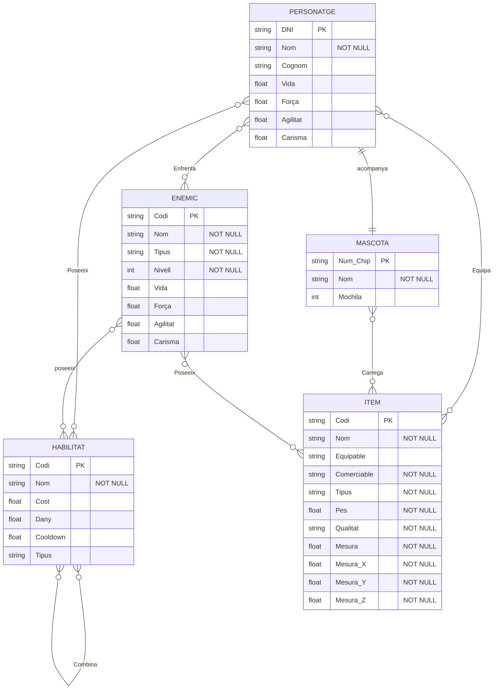

# Diagrama Mermeid GBD

```mermaid
erDiagram
    PERSONATGE }o--o{ HABILITAT : Poseeix
    PERSONATGE }o--o{ ITEM : Equipa
    PERSONATGE ||--|| MASCOTA: acompanya
    PERSONATGE }o--o{ ENEMIC: Enfrenta
    MASCOTA  }o--o{  ITEM : Carrega
    ENEMIC }o--o{ ITEM : Poseeix
    ENEMIC }o--o{ HABILITAT: poseeix   
    HABILITAT  }o--o{ HABILITAT: Combina

    MASCOTA {
        string Num_Chip PK
        string Nom "NOT NULL"
        int Mochila
    }
    PERSONATGE {
        string DNI PK
        string Nom "NOT NULL"
        string Cognom
        float Vida
        float Força
        float Agilitat
        float Carisma
    }
    ITEM {
       string Codi PK
       string Nom "NOT NULL"
       string Equipable
       string Comerciable "NOT NULL"
       string Tipus "NOT NULL"
       float Pes "NOT NULL"
       string Qualitat "NOT NULL"
       float Mesura "NOT NULL"
       float Mesura_X "NOT NULL"
       float Mesura_Y "NOT NULL"
       float Mesura_Z "NOT NULL"
    }
    HABILITAT {
      string Codi PK
      string Nom "NOT NULL"
      float Cost
      float Dany
      float Cooldown
      string Tipus
    }
    ENEMIC {
      string Codi PK
      string Nom "NOT NULL"
      string Tipus "NOT NULL"
      int Nivell "NOT NULL"
      float Vida
      float Força
      float Agilitat
      float Carisma
    }
```
