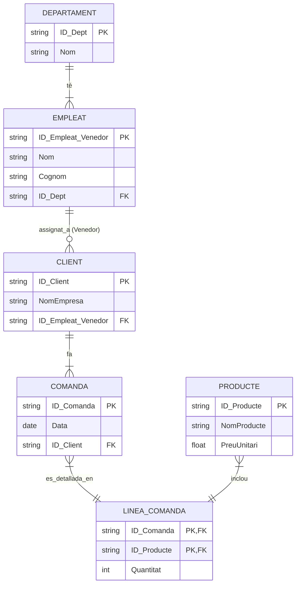

# Diagrama

```mermaid
erDiagram
     DEPARTAMENT||--|{ EMPLEAT : té
    EMPLEAT||--o{ CLIENT: "assignat_a (Venedor)"
    CLIENT ||--|{ COMANDA: fa
    COMANDA }|--|| LINEA_COMANDA : es_detallada_en
    PRODUCTE}|--|| LINEA_COMANDA : inclou
    EMPLEAT {
    string ID_Empleat_Venedor PK
    string Nom
    string Cognom
    string ID_Dept FK
    }
    DEPARTAMENT{
        string ID_Dept PK
        string Nom
    }
    CLIENT{
        string ID_Client PK
        string NomEmpresa
        string ID_Empleat_Venedor FK
    }
    COMANDA {
        string ID_Comanda PK
        date Data
        string ID_Client FK
    }
    LINEA_COMANDA {
        string ID_Comanda PK,FK
        string ID_Producte PK,FK
        int Quantitat
    }
    PRODUCTE{
        string ID_Producte PK
        string NomProducte
        float PreuUnitari
    }
```
